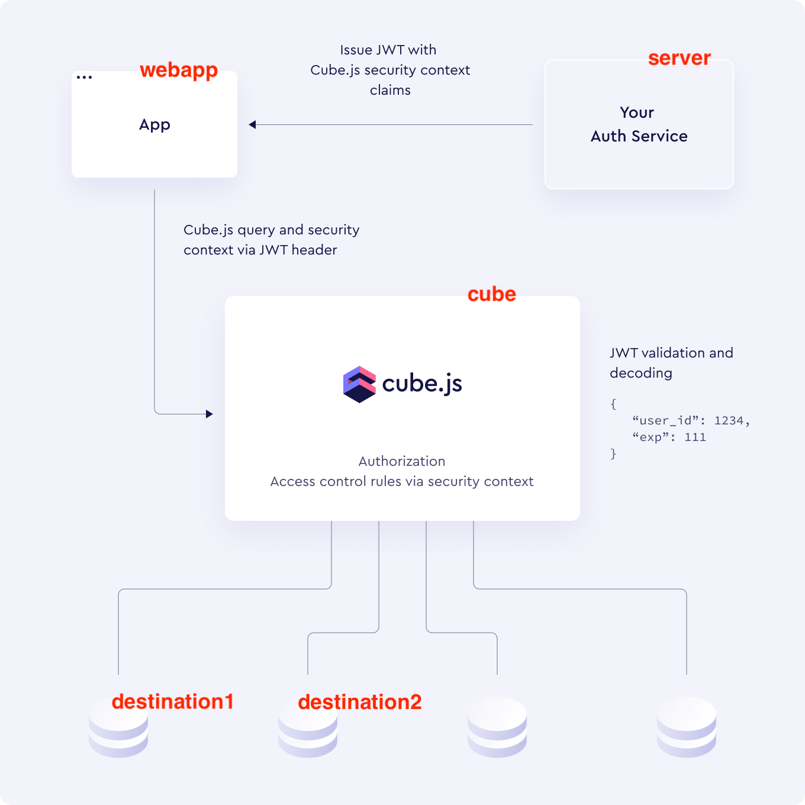

# Prototype: Cube.js multi-tenancy

This is a prototype to prepare for the implementation of Embeddable in Eyk 🔥🔥

Embeddable leverages Cube.js to power their caching layer. This is one of the strong points of Embeddable, because Cube.js is a well maintained & stable open-core project with a promising future.

### Goals of the prototype, in decreasing order of priority

1. Dynamically load tenants (and their destinations) into the caching layer
2. Implement basic authentication flow
3. Fetch data from cube per tenant dynamically
4. Load models per tenant dynamically

And, of course, the prototype should be minimal in the sense that it just does what is required to reach the above goals, and nothing more.

### Prototype overview



- cube - caching layer, at startup unaware of the different tenants
- server - backend server, holds the different tenants and the connection details of their destinations
- webapp - uses the server to list tenants, allows to select a tenant, fetches data from cube for the selected tenant, then shows the data in the browser
- destination1 - local postgres instance representing the datawarehouse for tenant1
- destination2 - local postgres instance representing the datawarehouse for tenant2

These are the most important files in this repo:
- `cube/cube.py` - configuration for cube, defines how to handle context gotten from Json Web Token to connect to the different destinations per tenant
- `server/main.py` - shows how to generate the jwt token that holds the context
- `webapp/App.js` - shows how to create a cube client with a jwt token and fetch data from the cube service

### Running the prototype

1. Run the prototype with docker compose
```bash
docker compose up
```

2. Go to [http://localhost:3000](http://localhost:3000) in your browser

3. Fetch the available tenants in the backend server by hitting the `List tenants from API` buttin

4. Switch between tenants in the drop down and see how the data is fetched from Cube, that in turn connects to the destination that belongs to the selected tenant dynamically based on the retrieved destination config

### Open topics / questions

- Will the implementation of `cube/cube.py` be handled on the Embeddable side or on the Eyk side?
  - If handled on the Embeddable side:
    - We want to pass in a list of data models to include. How will this work with your implementation of `repository_factory()`?
    - What is the structure of the security context to include in the token? Example for BigQuery would help
  - If implemented by Eyk, is the current set-up "optimal"?
    - How to best set up default security context in `scheduled_refresh_contexts()`?
    - How to deal with incomplete context passed in function calls, eg from default security context?
    - Should we use a separate orchestrator per tenant? `context_to_orchestrator_id()`
    - Anything missing?
- Caching behavior configuration, some examples and best practices would help here

### References

These pages in the documentation helped understand cube and how to configure it:
- https://cube.dev/docs/product/auth
- https://cube.dev/docs/product/auth/context
- https://cube.dev/docs/product/configuration/advanced/multitenancy (note: Embedddable works with COMPILE_CONTEXT, not query rewrite)
- https://cube.dev/docs/reference/configuration/config
